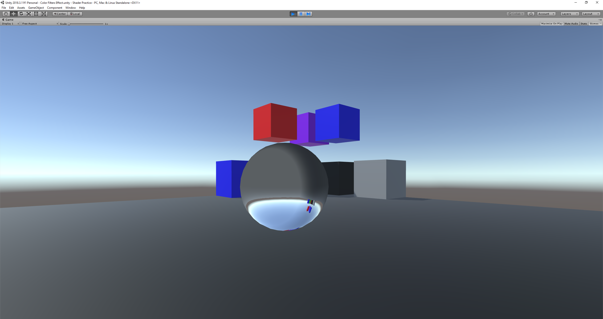
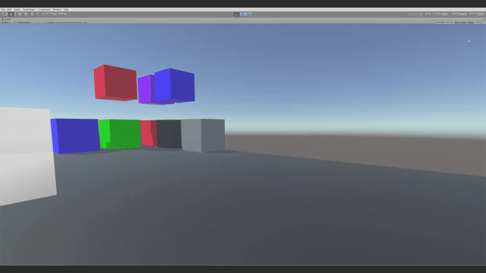
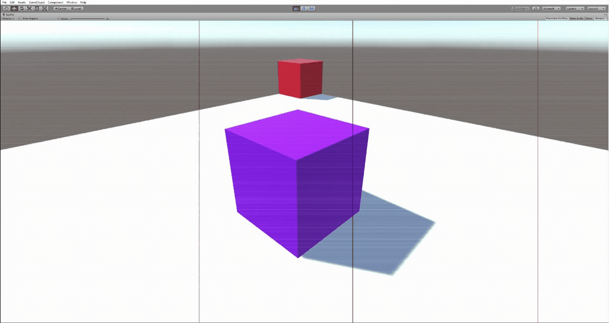
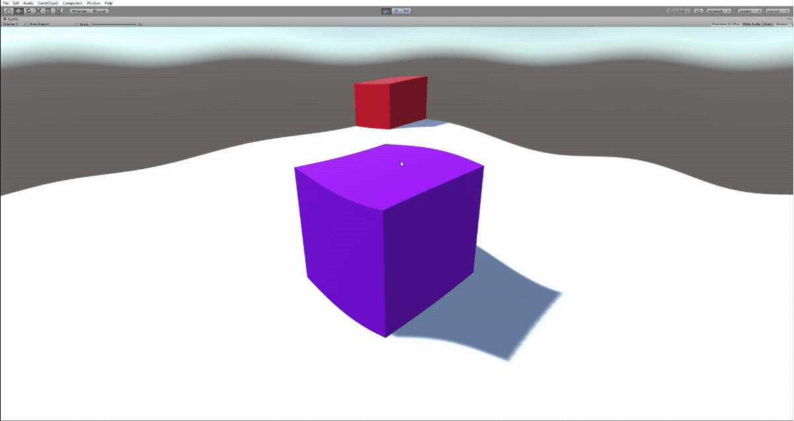

# Unity Shader Playground
This is a backup of a project I did a while ago. Here is where I just scratched the surface of the many wonderful things you can do with shader programming.

## Glass Ball Effect

## Unfinished black hole effect (spacetime warping)

## B&W filter effect

## TV static effect

*this was a fun failed attempt at making this effect*

## wavy & wobbly effect

